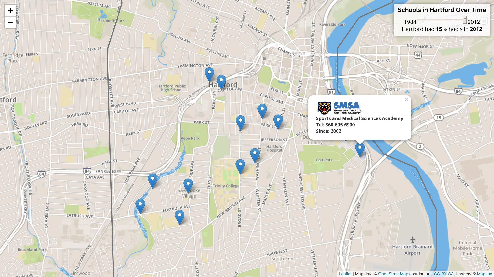
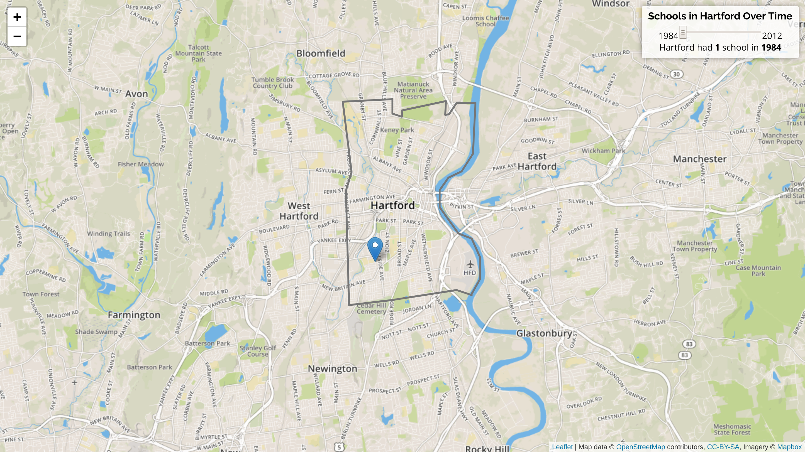
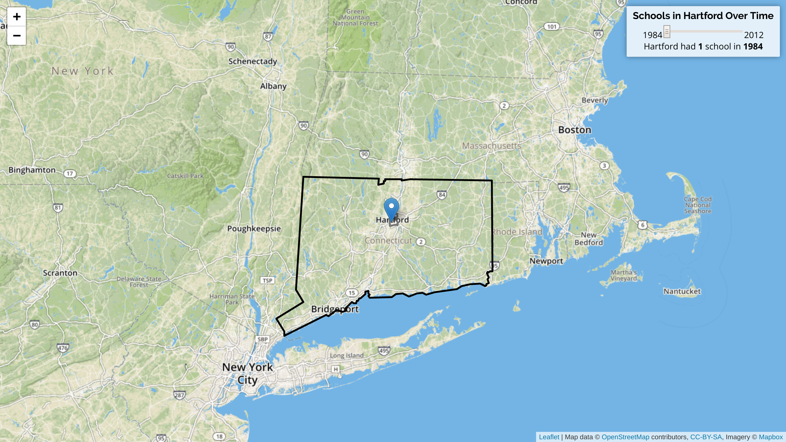

# Timeline of Schools in Hartford: 1984 - 2014 #
This project is a cartographic visualisation of schools in Hartford from 1984 to 2012.
It was written as an experiment into data science and visualisation.

[Live Example](https://moolenaar.cc/hfd-schools)

Here is what it looks like:





## Introduction to Data Science and Leaflet ##
As someone new to data science and visualisation, I started off by learning the
foundations of data science through a [Lynda.com](https://lynda.com) course, and 
the [datavizforall](https://datavizforall.org) book by Prof. Dougherty, among other
resources on the web. Besides becoming well acquanited with the Leaflet API, I developed
varying levels understanding of technologies such as: d3.js, geojson,
highcharts, openrefine, and various others related to GIS.

## Working with Open Data ##
Since this project is inteded to be a dive into data visualisation, I didn't
really have a story to tell; so I looked for Open data. 

After browsing the catalogue of datasets available on
[CTData](https://data.ct.gov) and [HartfordData](https://data.hartford.gov),
I arbitrarily decided to visualise a timeline depicting the growth of the number
of schools in CT. The dataset leveraged in this project is 
[CT-Schools by Type with Town Boundaries](https://data.ct.gov/Education/CT-Schools-by-Type-w-Town-Boundaries/8pjp-nyd7)

To my understanding, this "Open Data" is meant to be used by developers and
analysts; however, it is very cryptically and terribly designed. In its JSON
form, data that is meant to be "easy for humans to read and write"
([JSON Spec](https://json.org)), is rather cryptically designed. The datasets
I multiple datasets I attemped to work with, essentially dumped an unlabeled,
cluttered representation of the data. Consequently, I preprocessed (and
truncated) the data, for simplicity, ease of use, and readability.

This is what a single entry in the raw JSON file looks like:
```json
[ 
  398,
  "12B416F6-04D1-4F68-B541-60CE9A3A4A42",
  398,
  1477676201,
  "878954",
  1477676225,
  "878954",
  null,
  "Sports and Medical Sciences Academy",
  "Public Schools",
  "0646511",
  [
    "{\"address\":\"280 Huyshope Avenue\",\"city\":\"Hartford\",\"state\":\"CT\",\"zip\":\"06106\"}",
    "41.752365",
    "-72.660526",
    null,
    false
  ],
  "06106",
  "860-695-6900",
  "0",
  "0",
  "0",
  "0",
  "0",
  "0",
  "0",
  "1",
  "1",
  "1",
  "1",
  "1",
  "1",
  "1",
  "01Jul2002 0:00:00.000",
  "1"
]
```

As contrast, here is the same entry after processing:
```json
{
  "name": "Sports and Medical Sciences Academy",
  "coord": [41.752365, -72.660526],
  "pincode": "06106",
  "tel": "860-695-6900",
  "since": "01Jul2002 0:00:00.000",
  "logo":"https://static1.squarespace.com/static/52045886e4b061002eaa753f/t/5317f617e4b0d5b56218ebce/1521216094515/%3Fformat=1500w"
}
```


## Data Preprocessing ##
After manually reading the raw data file, I tried to locate where relevant
information was within the sea of unexplained values. Eventually, I authored a
python script called `sanitise`, that *sanitise*d the raw data file into one
that was easier to programmatically work with --- at least at my scale.

I lost a lot of data like the Town Boundaries and Addresses (among other things
I couldn't identify) beacuase it would simply have taken too long to understand
how it worked, and how it needed to be extracted)

TODO: sample row from data.json v. sample row from data.js

## Data Visualisation ##
With a high level vision in mind, I implemented all functionality relying only
on [Leaflet's API](http://leafletjs.com) and [Vanilla JavaScript](https://developer.mozilla.org/en-US/docs/Web/JavaScript).

## Notes ##
  * Since I could not find an existing exportable geoJSON version of CT and
    Hartford's boundariers, I manually created them using
    [geoJSON.io](https://geojson.io).
  * The map is not draggable because of a conflict with the slider. In a
    production version, this would be fixed.
